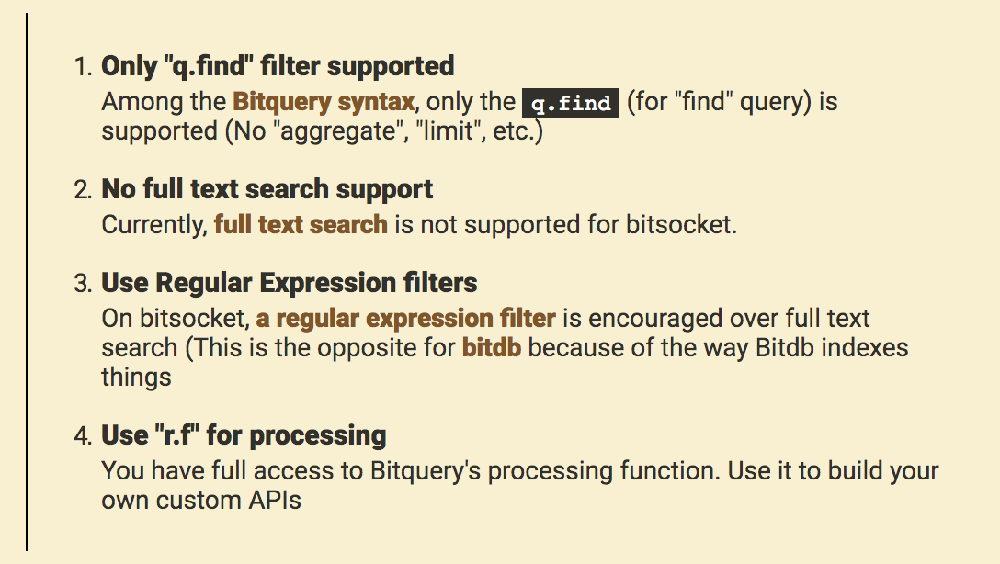

# Rvnplaylist

A community powered repository of Rvnquery examples. You are very welcome to send a pull request if you have a useful query.

This repository is made up of two categories:

1. Rvndb
2. Rvnsocket

Both [rvndb](https://bitdb.network) and [rvnsocket](https://bitsocket.org) use [Rvnquery](https://docs.bitdb.network/docs/query_v3) as the query language, so you can use exactly the same query to fetch (RvnDB) AND monitor (Rvnsocket) the blockchain.

However Rvnsocket supports a subset of Rvnquery. Specifically:

# Examples

- [RvnDB Examples](./rvndb/README.md)
- [rvnSocket Examples](./rvnsocket/README.md)

